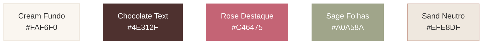

# 🌸 Identidade Visual & Design System — Encantos da Faby

Este guia documenta o Design System oficial do e-commerce **Encantos da Faby**, extraído diretamente da identidade cromática e tipográfica da marca.

---

## 🎨 Paleta de Cores (Extraída da Logo)

A paleta de cores foi desenvolvida para refletir delicadeza, afeto e a natureza artesanal do crochê de alto padrão.

| Cor | Hex | HSL | Aplicação no CSS | Uso Recomendado |
| :--- | :--- | :--- | :--- | :--- |
| **Fundo Principal (Cream)** | `#FAF6F0` | `hsl(38, 45%, 96%)` | `--bg-main` | Cor de fundo geral do site. Passa sensação de aconchego e suavidade. |
| **Texto & Títulos (Chocolate)** | `#4E312F` | `hsl(6, 30%, 25%)` | `--text-primary` | Títulos principais (`h1`, `h2`), texto corrido e detalhes de alto contraste. |
| **Destaque Primário (Rose)** | `#C46475` | `hsl(350, 48%, 58%)` | `--color-primary` | Botões principais (CTAs), ícones ativos e links em hover. |
| **Destaque Secundário (Sage)** | `#A0A58A` | `hsl(72, 13%, 59%)` | `--color-secondary` | Badges de status ("Pronta Entrega"), detalhes botânicos e botões secundários. |
| **Bordas & Cards (Sand)** | `#EFE8DF` | `hsl(28, 25%, 92%)` | `--border-soft` | Bordas sutis, divisores, e fundo de cartões de produtos. |

---

## 🔤 Tipografia Premium

Para manter a consistência com a sofisticação da marca e a excelente legibilidade na web:

### 1. Títulos (`h1`, `h2`, `h3`, `h4`)
* **Fonte**: `Playfair Display` (Serif)
* **Importação**: `@import url('https://fonts.googleapis.com/css2?family=Playfair+Display:ital,wght@0,400..900;1,400..900&display=swap');`
* **Estilo**: Elegante, com curvas clássicas que remetem à delicadeza do crochê e à caligrafia artesanal da logo.

### 2. Corpo, Botões e Inputs (`p`, `span`, `button`, `input`)
* **Fonte**: `Outfit` (Sans-serif)
* **Importação**: `@import url('https://fonts.googleapis.com/css2?family=Outfit:wght@100..900&display=swap');`
* **Estilo**: Moderno, limpo, geométrico e com excelente legibilidade em telas de qualquer tamanho.

---

## 🖼️ Recursos da Marca

* **Logo Principal**: Localizada em [logo.png](file:///c:/Users/Laboratorio/Documents/Encantos%20da%20Faby/Identidade%20Visual/logo.png). Deve ser exibida no cabeçalho do site (Navbar) e no rodapé.
* **Formatos de Imagem**: Utilizar fundos transparentes para manter a suavidade do creme do fundo principal.
