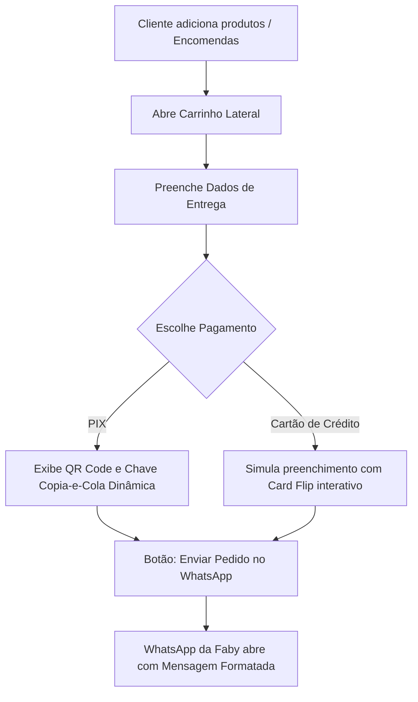

# 🛒 Diretrizes de Desenvolvimento de E-commerce Premium

Este guia estabelece as melhores práticas de Engenharia de E-commerce e UI/UX para a criação de lojas online de alta conversão, focado especificamente na integração local e experiência do usuário (baseado nos padrões de ponta de Portable Agent Skills).

---

## 🛍️ 1. Princípios de Conversão & UX (DTC Premium)

1. **Imagens em Primeiro Lugar**: O crochê é uma arte extremamente tátil e visual.
   - As imagens dos produtos devem ser exibidas em alta resolução, com proporção quadrada (`aspect-ratio: 1/1`) ou vertical suave (`3/4`).
   - Efeito de zoom ou troca de imagem suave ao passar o mouse (hover) para exibir detalhes dos pontos do crochê.
2. **Clareza de Estoque**: 
   - Diferenciar de forma visualmente imediata itens de **Pronta Entrega** (com botão "Adicionar à Sacola") e itens **Sob Encomenda** (com botão "Personalizar & Encomendar").
3. **Redução de Fricção no Checkout**:
   - Manter o carrinho sempre acessível de forma lateral (Slide-over) para que o usuário não perca o contexto da navegação.
   - Solicitar apenas os dados essenciais para a entrega e envio do pedido.

---

## 🎨 2. Configurações de Design (Alinhadas ao Taste-Skill)

Configuraremos a aplicação utilizando os seguintes "dials" estéticos do **taste-skill**:

* **`DESIGN_VARIANCE: 7`** (Visual elegante e equilibrado, focado na organicidade das curvas e tramas de crochê).
* **`MOTION_INTENSITY: 6`** (Transições de fade-in suaves, animação lateral do carrinho, efeito físico nos botões `:active`, e efeito interativo de virada de cartão de crédito no checkout).
* **`VISUAL_DENSITY: 3`** (Design espaçado, limpo, estilo "Art Gallery", permitindo que as fotos dos produtos respirem).

---

## 💳 3. Lógica do Checkout Híbrido (Local + WhatsApp)

Como a loja opera em escala independente/artesanal, o fluxo de fechamento de pedido é otimizado para combinar o profissionalismo de um checkout automatizado com a flexibilidade do atendimento personalizado da Fabíola:



### Formato da Mensagem do WhatsApp
A mensagem gerada pelo código JavaScript deve ser limpa, estruturada e conter marcadores visuais. Exemplo:

```text
🌸 *NOVO PEDIDO - ENCANTOS DA FABY* 🌸
-----------------------------------------
👤 *Cliente:* Ana Silva
📞 *Contato:* (11) 99999-9999
📍 *Entrega:* Rua das Flores, 123 - São Paulo/SP

🛒 *ITENS DO PEDIDO:*
• 1x Bolsa Classic de Crochê (Pronta Entrega) - R$ 180,00
• 1x Amigurumi Ursinho (Sob Encomenda) - R$ 120,00
  └ *Cor da linha:* Rosa Chá (Fio #12)
  └ *Tamanho:* Padrão (25cm)
  └ *Detalhes:* Gravar nome "Theo" na etiqueta

💰 *Subtotal:* R$ 300,00
🚚 *Frete (SEDEX):* R$ 20,00
👉 *TOTAL:* R$ 320,00

💳 *Forma de Pagamento Escolhida:* PIX
-----------------------------------------
_Pedido gerado automaticamente pelo site Encantos da Faby._
```

---

## 🗄️ 4. Estrutura de Dados do Catálogo (JSON Local)

Para manter a aplicação leve e otimizada (sem necessidade de banco de dados externo complexo), estruturaremos o catálogo de produtos local em um arquivo Javascript usando o seguinte esquema de dados:

```javascript
const products = [
  {
    id: "bolsa-classic",
    name: "Bolsa Classic de Crochê",
    category: "Moda & Acessórios",
    price: 180.00,
    type: "pronta-entrega", // 'pronta-entrega' ou 'sob-encomenda'
    image: "caminho/para/imagem.jpg",
    description: "Bolsa artesanal elegante com alça de couro e forro interno acetinado."
  },
  {
    id: "amigurumi-ursinho",
    name: "Amigurumi Ursinho de Pelúcia",
    category: "Mundo Infantil",
    price: 120.00,
    type: "sob-encomenda",
    image: "caminho/para/imagem2.jpg",
    description: "Ursinho fofinho tecido em fio 100% algodão hipoalergênico.",
    customizable: {
      colors: ["#C46475", "#A0A58A", "#EFE8DF"], // Opções reais de cores
      sizes: ["Padrão (25cm)", "Grande (40cm)"]
    }
  }
];
```
